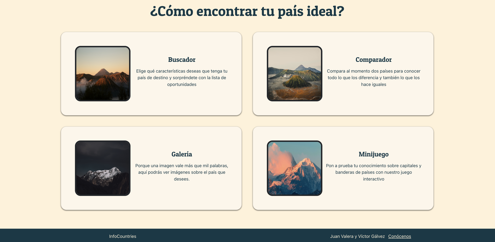
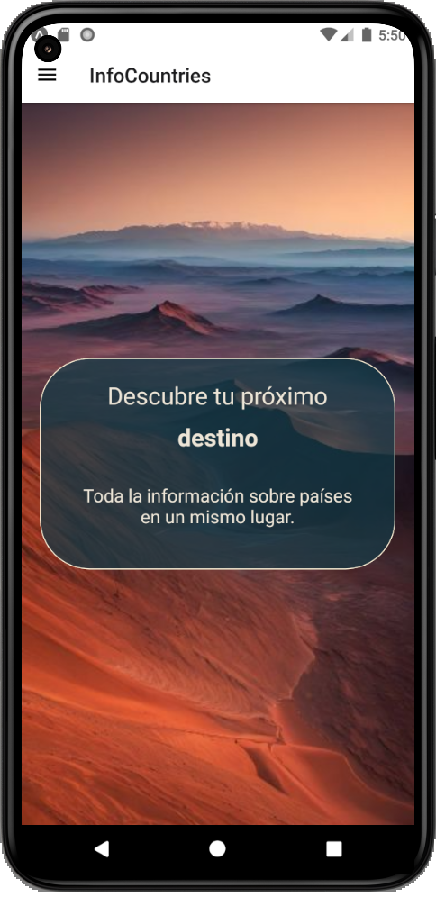
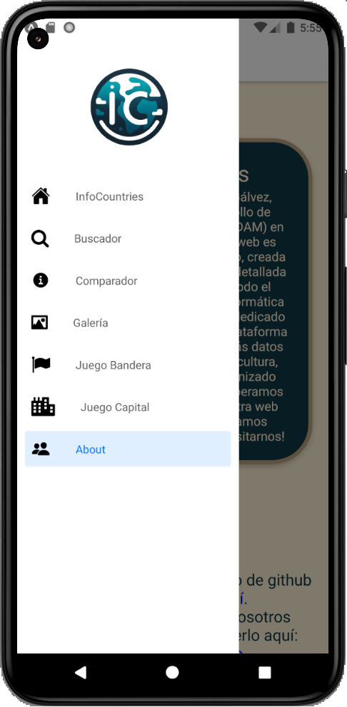
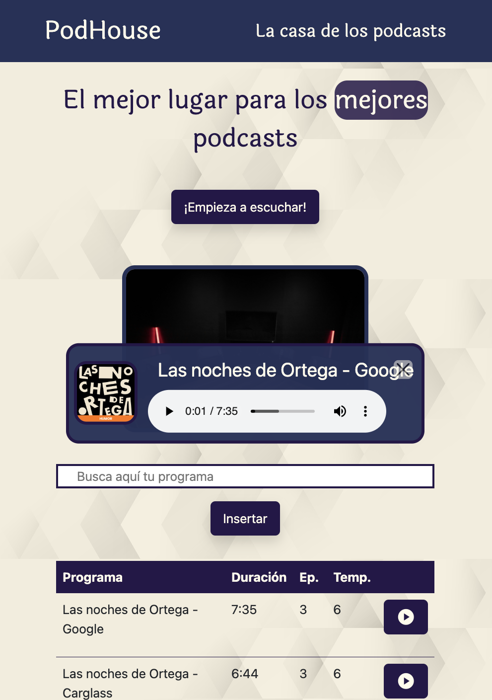
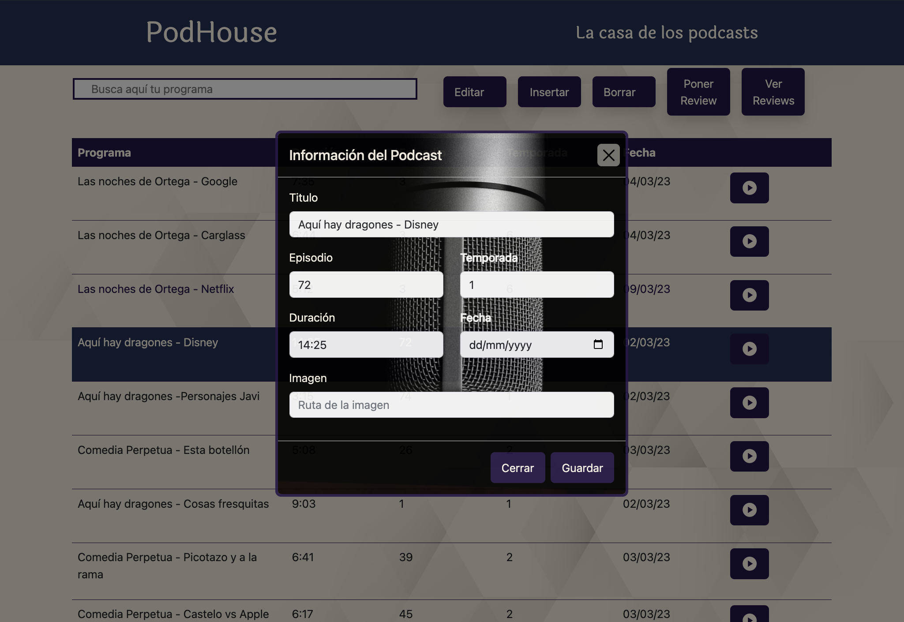

# Projects

//TODO: Añadir proyectos de android, tanto jetpack compose como android views y añadir algún que otro proyecto de las
prácticas.

Here you can find some of the projects I have worked on.

## <a href="https://github.com/JuanValeraDev/InfoCountries" target="_blank">Infocountries</a>

This is a project made with my partner <a href="https://github.com/VictorGlvez" target="_blank">Víctor Gálvez</a>. It is
related to countries information. You can search for information about a country, see a gallery of images, make a
comparation between two countries and play a quiz about countries.

This project is made with React, Bootstrap, Express and API consumption, like chatgpt 3.5 turbo, restcountries or
pexels. It is located on <a href="https://infocountrieswebservice.onrender.com/" target="_blank">Render</a>.

## <a href="https://github.com/VictorGlvez/InfoCountriesReactNative" target="_blank">Infocountries React Native</a>

This is the version of the previous project for mobile devices. It is made with React Native and Expo.

{ width=250 height=auto }

{ width=250 height=auto }

## <a href="https://github.com/JuanValeraDev/Podhouse" target="_blank">Podhouse</a>

This is a little project I did to practice HTML, CSS, Javascript and responsive design. It is a very simple page that
offers pieces of humor podcasts.

{ width=350 height=auto }

{ width=auto height=250 }

